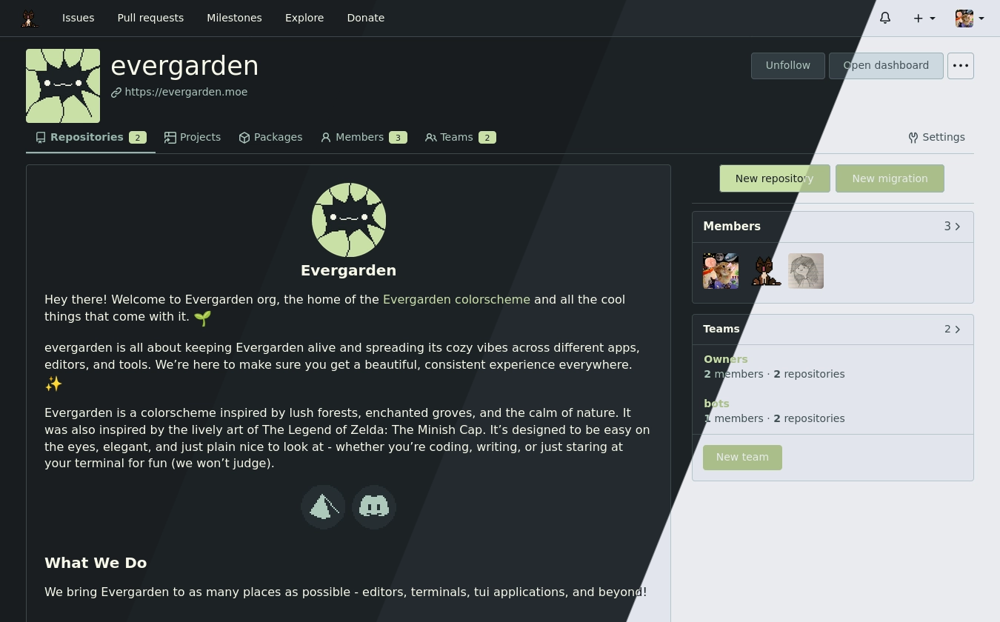
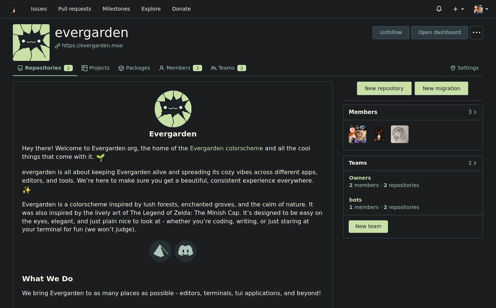
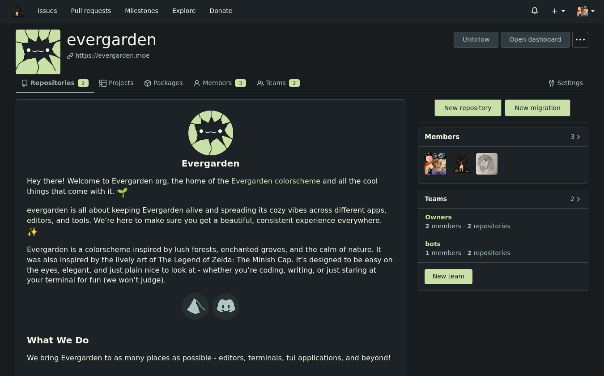
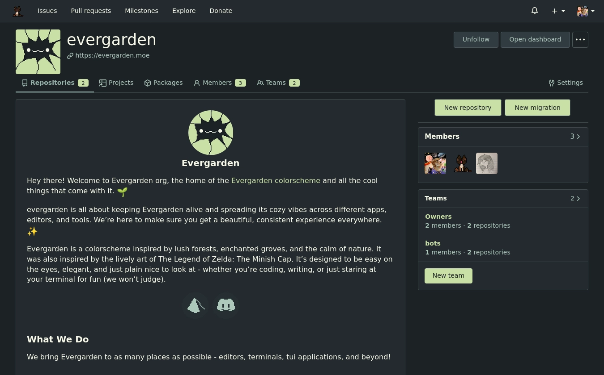
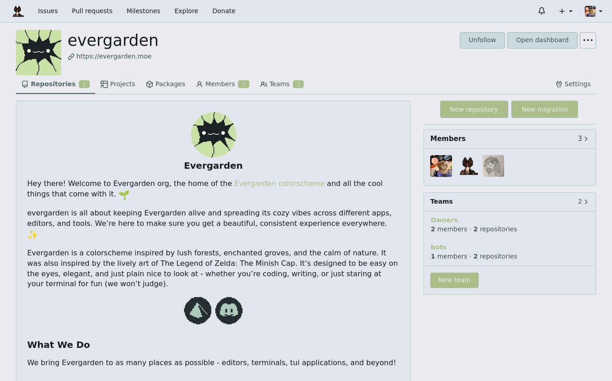

<h3 align="center">
   
  Evergarden for <a href="https://about.gitea.com">Gitea</a> and <a href="https://forgejo.org">Forgejo</a>
</h3>

  
  
  

  

### Previews

  
Winter

  

  
Fall

  

  
Spring

  

  
Summer

  

### Usage

Refer to [catppuccin's usage section](https://github.com/catppuccin/gitea?tab=readme-ov-file#usage) for instructions.

### Thanks to <3

- [june](https://git.koi.rip/koi)
- [winston](https://github.com/nekowinston)
- [catppuccin](https://github.com/catppuccin/gitea)

  

